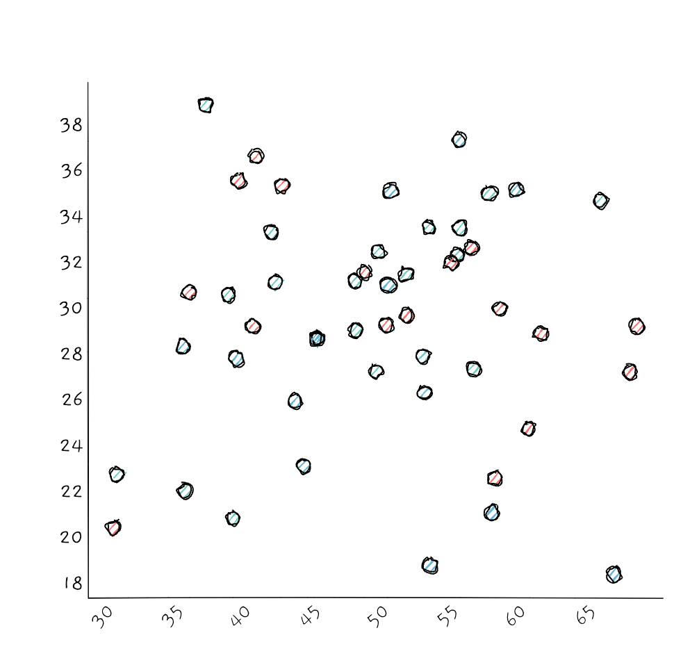

# roughVizR

> An R interface to the [roughViz.js](https://github.com/jwilber/roughViz) library for creating hand-drawn, sketchy styled charts.

[](https://github.com/ashgreat/roughVizR)
[](https://opensource.org/licenses/MIT)

Create beautiful hand-drawn style charts directly in R! This package provides R bindings for the popular roughViz.js library, allowing you to create sketchy, artistic visualizations with a hand-drawn aesthetic.

## Gallery

### Bar Chart


### Scatter Plot with Color Grouping


### Line Graph


### Pie Chart


### Donut Chart


### Horizontal Bar Chart


### Stacked Bar Chart


## Installation

```r
# Install from GitHub
devtools::install_github("ashgreat/roughVizR", subdir = "roughViz")

# Or install the development branch explicitly
remotes::install_github("ashgreat/roughVizR", subdir = "roughViz", ref = "main")
```

## Usage

### Basic Bar Chart

```r
library(roughVizR)

# Create sample data
data <- data.frame(
  labels = c("North", "South", "East", "West"),
  values = c(10, 5, 8, 3)
)

# Create a rough bar chart
roughBar(
  data = data,
  labels = "labels",
  values = "values",
  title = "Regional Sales",
  color = "coral",
  roughness = 2,
  fillStyle = "cross-hatch"
)
```

### Pie Chart

```r
# Create pie chart data
pie_data <- data.frame(
  labels = c("A", "B", "C", "D"),
  values = c(30, 20, 25, 25)
)

roughPie(
  data = pie_data,
  labels = "labels",
  values = "values",
  title = "Distribution",
  colors = c("#ff6b6b", "#4ecdc4", "#45b7d1", "#f9ca24")
)
```

### Line Chart

```r
# Create line chart data
line_data <- data.frame(
  x = 1:10,
  y = c(3, 7, 2, 9, 4, 6, 8, 5, 10, 3),
  y2 = c(5, 2, 8, 3, 7, 4, 9, 6, 2, 8)
)

roughLine(
  data = line_data,
  x = "x",
  y = "y",
  y2 = "y2",
  title = "Trend Analysis",
  colors = c("coral", "skyblue"),
  circle = TRUE,
  circleRadius = 8
)
```

### Scatter Plot

```r
# Create scatter plot data
scatter_data <- data.frame(
  x = rnorm(50, mean = 50, sd = 10),
  y = rnorm(50, mean = 30, sd = 5),
  group = sample(c("A", "B", "C"), 50, replace = TRUE)
)

roughScatter(
  data = scatter_data,
  x = "x",
  y = "y",
  colorVar = "group",
  title = "Random Distribution",
  colors = c("#ff6b6b", "#4ecdc4", "#45b7d1"),
  radius = 10
)
```

### Donut Chart

```r
roughDonut(
  data = pie_data,
  labels = "labels",
  values = "values",
  title = "Donut Distribution",
  colors = c("#ff6b6b", "#4ecdc4", "#45b7d1", "#f9ca24"),
  roughness = 3
)
```

### Horizontal Bar Chart

```r
roughBarH(
  data = data,
  labels = "labels",
  values = "values",
  title = "Horizontal Bars",
  color = "pink",
  fillStyle = "zigzag"
)
```

### Stacked Bar Chart

```r
# Create stacked bar data
stacked_data <- data.frame(
  labels = c("Q1", "Q2", "Q3", "Q4"),
  ProductA = c(20, 30, 25, 35),
  ProductB = c(15, 20, 18, 22),
  ProductC = c(10, 15, 12, 18)
)

roughStackedBar(
  data = stacked_data,
  labels = "labels",
  title = "Quarterly Sales by Product",
  colors = c("#ff6b6b", "#4ecdc4", "#45b7d1")
)
```

## Chart Options

### Common Options

- `roughness`: Controls how rough the drawing is (0-10, default: 1)
- `fillStyle`: Style of fill ('hachure', 'cross-hatch', 'zigzag', 'dashed', 'solid', 'zigzag-line')
- `fillWeight`: Weight of fill lines
- `strokeWidth`: Width of stroke
- `bowing`: How much the lines bow (default: 0)
- `font`: Font style (0 = 'gaegu', 1 = 'indie flower', 2 = custom)
- `title`: Chart title
- `margin`: Margins (list with top, right, bottom, left)

### Using with Shiny

```r
library(shiny)
library(roughVizR)

ui <- fluidPage(
  titlePanel("roughViz in Shiny"),
  sidebarLayout(
    sidebarPanel(
      sliderInput("roughness", "Roughness:", min = 0, max = 10, value = 2),
      selectInput("fillStyle", "Fill Style:",
                  choices = c("hachure", "cross-hatch", "zigzag", "dashed", "solid"),
                  selected = "hachure")
    ),
    mainPanel(
      roughVizOutput("chart")
    )
  )
)

server <- function(input, output) {
  output$chart <- renderRoughViz({
    data <- data.frame(
      labels = c("A", "B", "C", "D"),
      values = c(10, 5, 8, 3)
    )
    
    roughBar(
      data = data,
      labels = "labels",
      values = "values",
      title = "Interactive Chart",
      roughness = input$roughness,
      fillStyle = input$fillStyle
    )
  })
}

shinyApp(ui = ui, server = server)
```

## License

This R package is licensed under MIT.

The roughViz.js library is created by Jared Wilber and licensed under MIT.
